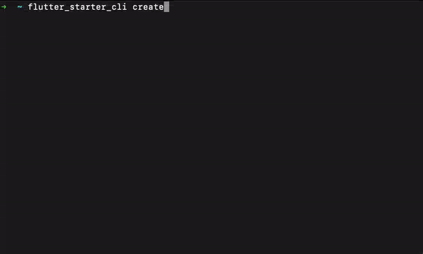

# Flutter Starter CLI

The `Flutter Starter CLI` is a very useful tool that provides commands for the ease of setting up a Flutter project from scratch.

## Introduction

`Flutter Starter CLI` is written in the Dart programming language.\
While working with the Flutter projects we have to write the same repetitive code multiple times but using this CLI, we can create a Flutter template on the fly.\
Also, the basic structure of all the tests in Flutter is the same. So this CLI also provides a basic starter pack for the Flutter test as well.

Out of the box, `Flutter Starter CLI` includes:-

- ✅ **State Management**
  - BLoC - BLoC is a popular design/architectural pattern that is used to separate the logic from the UI.
  - Riverpod - (Coming Soon... 🥳)
- ✅ **API-Services**
  - Dio - A powerful HTTP client for Dart, which supports Interceptors, Global configuration, FormData, Request Cancellation, File downloading, Timeout etc.
  - Http - A composable, Future-based library for making HTTP requests.
- ✅ **Basic Setup**
  - Themes - Themes are used to share colors and font styles throughout an app.
  - Localization - The project provides support for multiple languages like English, Spanish and French.
  - Routing - Go_Router is used to provide a convenient, URL-based API for navigating between different screens.
- ✅ **Testing**
  - Unit - A unit test tests a single function, method, or class.
  - Widget - A widget test tests a single widget.
  - Integration - An integration test tests a complete app or a large part of an app.

## Dependencies

Currently, the `Flutter Starter CLI` depends on the following packages:-

| Package       | Version | Description                                                                                                                  |
| ------------- | ------- | ---------------------------------------------------------------------------------------------------------------------------- |
| args          | 2.3.1   | Parses raw command-line arguments into a set of options and values.                                                          |
| mason_logger  | 0.1.3   | Simple logging library for CLI requests.                                                                                     |
| path          | 1.8.2   | The path package provides common operations for manipulating paths: joining, splitting, normalizing, etc.                    |
| pub_updater   | 0.2.1   | A Dart package which enables checking whether packages are up to date and supports updating them.                            |
| flutter_lints | 2.0.1   | This package contains a recommended set of lints for Flutter apps, packages, and plugins to encourage good coding practices. |

## Getting Started

Firstly clone the project on your system then run the following command:

```sh
dart pub global activate --source=path <path_to_this_project>
```

## Usage

In the root of your application, run the following commands:

```sh
# Show CLI version
$ flutter_starter_cli --version
```

```sh
# Show usage help
$ flutter_starter_cli --help
```

```sh
# To create project
$ flutter_starter_cli create

# Then follow instructions
```

```sh
# Shorthand to create project with git
$ flutter_starter_cli create <project_name> --api=<api_service> -g

# Shorthand to create project with test
$ flutter_starter_cli create <project_name> --api=<api_service> -t

# Shorthand to create project without git and test
$ flutter_starter_cli create <project_name> --api=<api_service>

# Available API services (dio, http)
```

## Complete Usage

The complete usage of the create command with options and flags.

```sh
➜  ~ flutter_starter_cli create
Creates a new flutter starter project.

Usage: flutter_starter_cli create <project_name>
-h, --help         Print this usage information.
    --desc         The description for the project.
                   (defaults to "A New Flutter Project.")
    --org          The organization for the project.
                   (defaults to "com.example")
-a, --api          The API service for the project.
                   [dio, http]
-t, --[no-]test    Setup Test Cases.
-g, --[no-]git     Initialize Git Repository.

Run "flutter_starter_cli help" to see global options.
```

## Directory Structure

The complete structure of the newly created project directory looks like this:

```
.
├── android
├── assets
├── integration_test
├── ios
└── lib
    ├── api_sdk
    ├── config
    ├── l10n
    ├── routes
    ├── screens
    ├── shared
    ├── themes
    ├── utils
    ├── widgets
    ├── app.dart
    ├── common_export.dart
    ├── main.dart
├── linux
├── macos
├── test
├── web
├── windows
├── .gitignore
├── analysis_options.yaml
├── l10n.yaml
├── pubspec.lock
├── pubspec.yaml
└── README.md
```

## Demo

A demo video to illustrate how to use the `Flutter_Starter_CLI`


